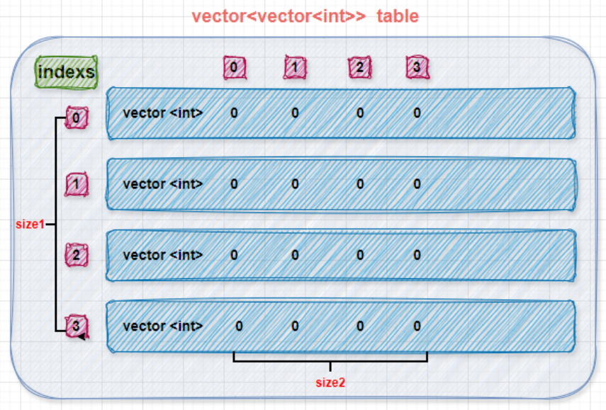

# STL: Container

## stack

|functions||
|---|---|
|top|access the top element|
|empty|check whether the contianer adaptor is empty|
|push|insert element|
|emplace|Construct and insert element|
|pop|Remove top element|

## queue

|functions||
|---|---|
|front|Access next element|
|back|Access last element|
|empty|check whether the contianer adaptor is empty|
|push|Insert element|
|emplace|Construct and insert element|
|pop|Remove next element|

## vector

|functions||
|---|---|
|front|Access first element|
|back|Access last element|
|empty|check whether the contianer adaptor is empty|
|resize(int num)|if longer, set defult; if shorter, delete extra elements|
|resize(int num, elem)|if longer, set elem; if shorter, same|
|push_back|Add element at the end|
|pop_back|Delete last element|

## 2-d vector



```c++
vector<vector<int>> table(size1,vector<int>(size2, 0));
```

## list
## string
## map