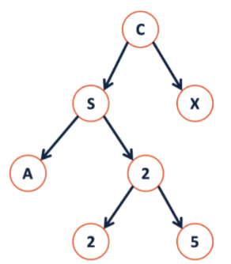
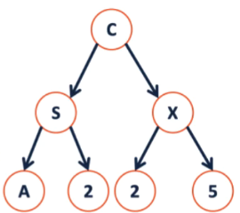
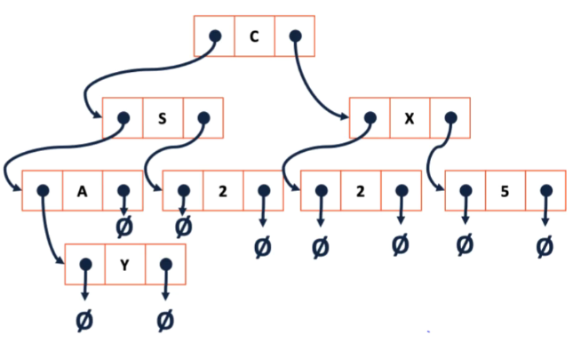
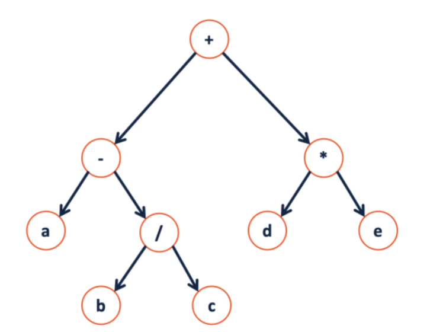
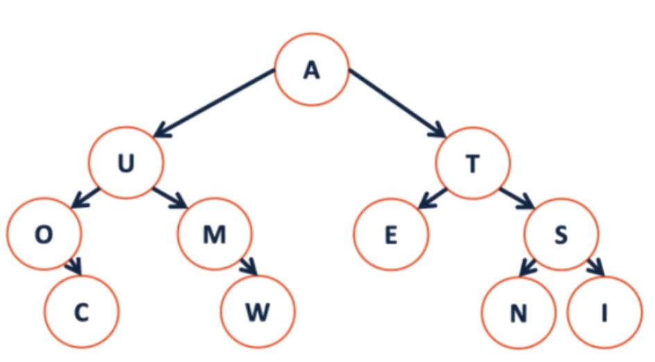

<font face="Times New Roman">
# Quiz4

## Trees
### Binary Tree
T={r, $T_r$, $T_l$}
or
T=$\emptyset$(empty tree)
### Tree Property:
***height(T):*** length of the longest path from root to a leaf
height(T) = max(h($T_l$), h($T_r$))+1
***Full:*** if and only if
1. F={}
2. F={r, $T_r$, $T_l$}where  $T_r$ and  $T_l$ are both $\emptyset$ or both not empty


(full not ~~perfect~~)
height(T)=4
***perfect:*** A perfect tree P is defined in terms of the tree's height.
Let $p_h$ be a perfect tree of height **h** and:
1. $P_{-1}$ = $\emptyset$ = {}
2. $P_h$ = {r, $T_r$, $T_l$} where $T_r$, $T_l$ are $P_{h-1}$

***complete:*** 
$\qquad$ **Conceptually:** A perfect tree for every level except the last, where the last level if "pushed to the left"
$\qquad$ **Slightly more formal:** For all level k in [0,h-1], k has $2^k$ nodes. For level h, all nodes are "pushed to the left"
A complete tree C of height h, $C_h$:
1. $C_{-1}$ = {}
2. $C_h$(where h>=0) = {r, $T_r$, $T_l$} and either:
   $T_l$ is $C_{h-1}$, $T_r$ is $P_{h-1}$
   or 
   $T_l$ is $P_{h-1}$, $T_r$ is $C_{h-1}$

Is every full tree complete?
***NO***
 ```mermaid
    graph TD
    A((A))
    B((B))
    C((C))
    D((D))
    E((E))
    A-->B  
    A-->C  
    C-->D
    C-->E
 ```
Is every complete tree full?
***NO***
 ```mermaid
    graph TD
    A((A))
    B((B))
    A-->B  
 ```
### Tree ADT:
```c++
template <class T>
class BinaryTree {
    public:
    /* */
    private:
    struct TreeNode{
        T data;
        TreeNode* left;
        TreeNode* right;
    }
    TreeNode* root_;
};
```

How many NULLs?
Theorem: If there are n data items in our representation of a binary tree, then there are ***n+1*** NULL pointers.

## Tree Traversal

***Pre Order Traversal:*** + - a / b c * d e
go left
fo right
```c++
template<class T>
void BinaryTree<T>::PreOrder(TreeNode *curr){
    if(curr){
        count << curr->data;
        PreOrder(curr->left);
        PreOrder(cuee->right);
    }
}
```
***In Order Traversal:*** a - b / c + d * e
```c++
template<class T>
void BinaryTree<T>::InOrder(TreeNode* curr){
    if(curr){
        InOrder(curr->left);
        count << curr->data;
        InOrder(cuee->right);
    }
}
```
***Post Order Traversal:*** a b c / - d e * +
```c++
template<class T>
void BinaryTree<T>::PostOrder(TreeNode* curr){
    if(curr){
        PostOrder(curr->left);
        PostOrder(cuee->right);
        count << curr->data;
    }
}
```
***A different type of Traversal***
```c++
//to be continued
```
## BST
#### Traversal VS. Search
**Traversal** visits every node in the tree exactly once
**Search** finds one element in the tree

find something not in the tree: search = traveral

##### Search: Breadth First vs. Depth First
**strategy:** Depth First Search(DFS)/ Traversal
（pre/post/in order）
Good at finding data at leaves if lucky, very fast

**strategy:** Breadth First Search(BFS)/ Traversal
Good at finding data near root
if key is in tree, it will find it even if tree is infinite. 
##### Search running time on a Binary tree

Worest case: search the whole tree BFS/DFS both O(n)

##### Dictionary ADT
Data is often organized into key/value pairs.
```c++
#pragma once
template<typename K, typename V>
class Dictionary{
    public:
    v find(const K & key);
    void remove(const K & key);
    void insert(const K & key, const V & val);
}
```


