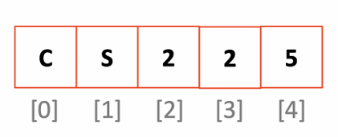
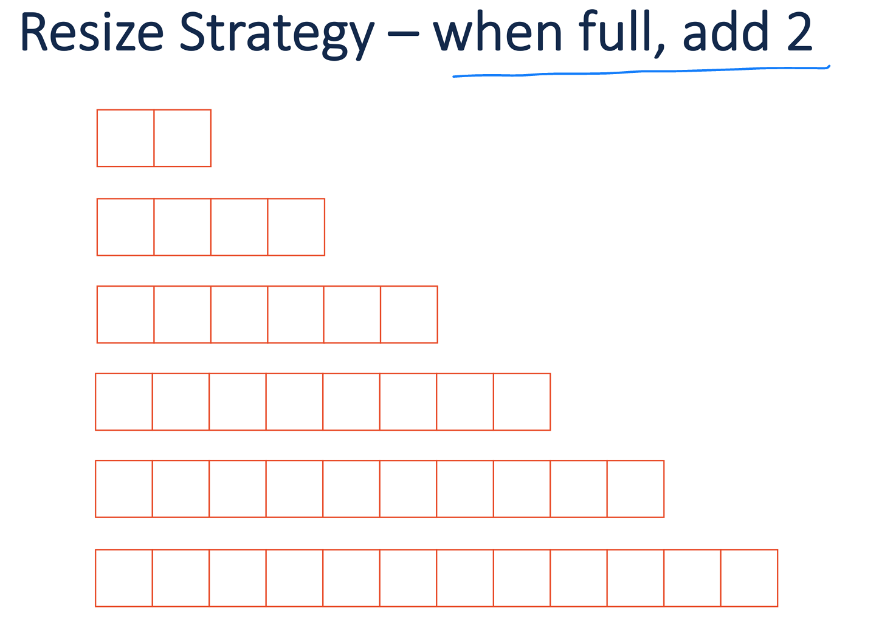
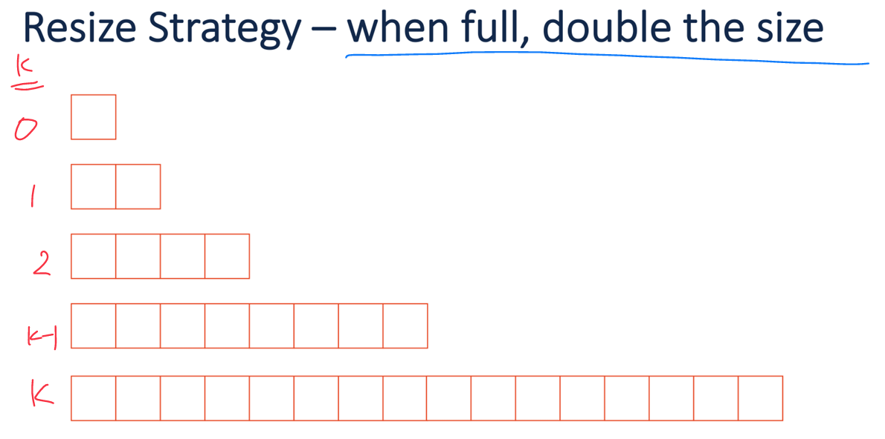
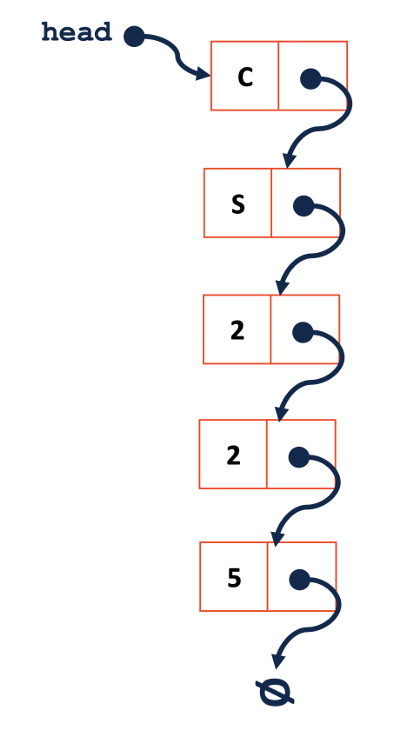
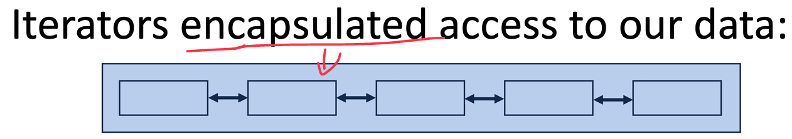
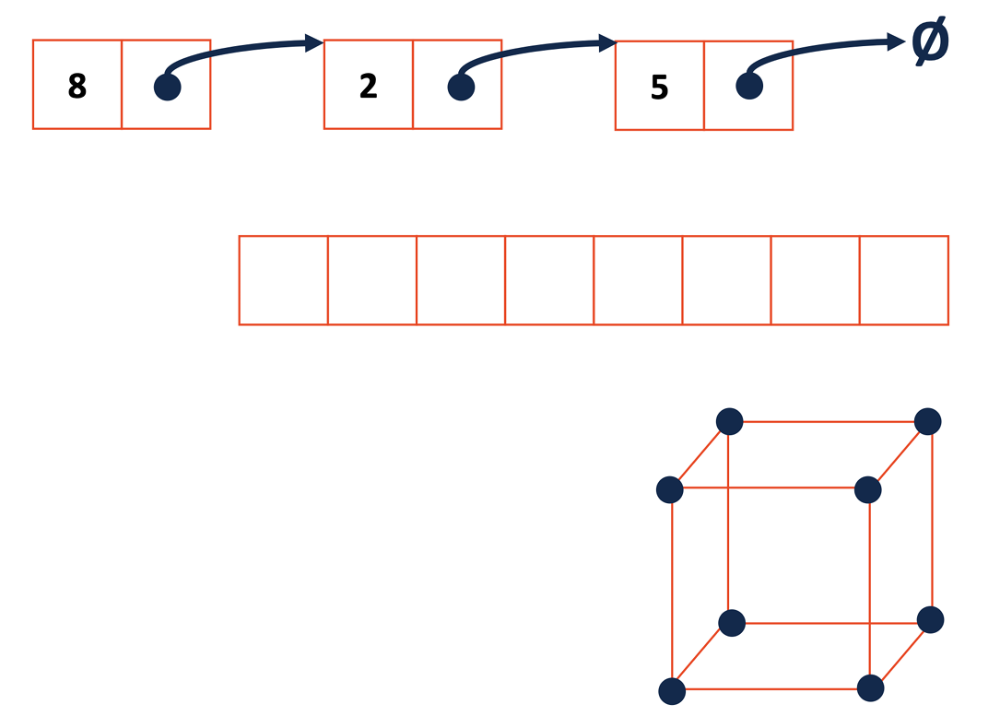

<font face="Times New Roman">
# Quiz3

## List implementation

1. Linked list (using points)
2. Array

|Array|Linked Lists|
|---|---|
|stored in contiguous location|not stored in contiguous location|
|fixed in size|dynamic in size|
|memory is allocated at compile time|memory is allocated in run time|
|use less memory than linked list|use more memeory(both data and address of the next node)|
|elements can be accessed easily|elements accessing requires the traversal of the whole list|
|insertation and deletion operation takes time|faster|


### Linked Memory

```c++
//list.h
class ListNode{
    T data;
    ListNode * next;
    ListNode( T & data) : data(data), next(NULL) { }
};

//struct
struct ListNode{
    T data;
    ListNode * next;
    //init list
    ListNode( T & data) : data(data), next(NULL) { }
};
```
#### struct vs. class
struct : 
1. start from public
2. never contain member functions

class : srart from private

```c++
class List{
    public:
        /* functions here */
    private:
        class ListNode{
            T data;
            ListNode * next;
            ListNode( T & data) : data(data), next(NULL) { };
        
        ListNode *head_;
};
}
```
**private class**: not available outside the class
**poblice class**: List::ListNode

if *ListNode * next* is not declared as pointer, it will head ListNode will contain every node's data.
#### insert at front:
```c++
#include "List.h"

template <typename T>
void List::insertAtFront(const T& d){
    ListNode * nex_node = new ListNode(d);
    new_node->next = head_;
    head_ = new_node;
}
```
##### runtime for insert at front:
1. if list empty? #operation = 3
2. if list contains n nodes? #operation = 3
   contain time = O(1) constant time


#### find node:
*recursion version* : tail recursion
##### Recursion
The process in which a function call itself directly or indirectly: ex. Tree travesal, factonial of a number

**Base case**: simplest case for the solution is trivial

**Recursion case**: define the problem in terms of small problems

***ensure the recursion terminates**


all work done before recursion
```c++
template<typename T>
typename List<T>::ListNode *& List<T>::_index(unsigned index){
        _index_help(head_, index);
    }
//not for sure
List<T>::ListNode *&_index_help(ListNode *& n, unsigned i){
    if(n == 0){
        return n;
    }
    else{
        return _index_help(n->next, i - 1);
    }
}
```
#### print reverse:
```c++
//not for sure
void List<T>printReverse() const{
    //any intuition
}
void List::helper(
    ListNode<T>*char{
        if(cur->next != NULL){
            _helper(curr->next);
            count<<cur->next<<endl;
        }
    }
)
```
##### Sentinel Node:
nodes designed nodes do not hold or refer to any data of the list
E.g. different conditions of insertion:
1. at the front of the linked list
2. after a given node
3. at the end of the linked lisk

#### modify node's data:
```c++
template<typename T>
T & List<T>::operator[](unsigned index){
    ListNode * node = _index(index);
    return node->data;
}

mylist[2] = 'i';
```

#### insert node:
1. find pointer to node at index 2
2. create new node with data
3. new node next is what at index 2
4. pointer to index 2 point to new node

```c++
template<typename T>
void List<T>::insert(const T & t, unsigned index){
    ListNode *& node =_index(index); // 1
    ListNode *new_node = new ListNode(t); // 2
    new_node->next = node; // 3
    node = new_node; //4
}
```
#### remove node:
```c++
template <typename T>
void List<T>::remove(unsigned index){
    ListNode *&node = _index(index);
    ListNode * tmp = node; // purpose save when node changes
    node = node->next;
    delete tem; // clean up memory;
}
```
### Array

```c++
template <typename T>
class List{
    public:
        /* functions here */
    private:
        T * data_;
        unsigned size_;
        unsigned cap_;
};
```
## Array implementation

```c++
T getdata(unsigned index){
    return data_[index];
}

addBack(& value){
    data_[size_] = value;
    size++;
}
```
what if full?
full allocate new copy free old 
## resize

$$
\sum_{k=0}^\infty 2k = r^2 + r
$$
r: number of rounds
n: number of items
r = $\frac{n}{2}$
$$
(\frac{n}{2})^2 + \frac{n}{2} = \frac{n^2 + 2n}{4}
$$
O($n^2$) copies for n items

n insert takes O($n^2$) time
one insert takes $\frac{O(n^2)}{n} = O(n)$



$$
\sum_{k=0}^{r} 2^r= 2(2^r-1)+1
$$
$$
2^r = n \\ r= lg(n) 
$$
2n-1 copies for n inserts:$\frac{O(n)}{n}$
Amortized O(1) runtime

2n space to store n items
O(n) for n items or O(1) per item

|    |Singly Linked List| Array|
|:----|:------------------:|:------:|
|insert/remove at front|O(1)|Amortized O(1)//we may need allocate new space |
|insert at given element|O(1)//given location|O(n)worest case: all element have to be moved|
|remove at given element|O(1)//given location|O(n)worest case: all element have to be moved|
|insert at arbitrary location|O(n)|O(n)worest case: all element have to be moved|
|remove at arbitrary location|O(n)|O(n)worest case: all element have to be moved|

## Array List vs. Linked List 时间复杂度对比

### ​**Array List (动态数组)**
| 操作                  | 无序列表      | 有序列表      | 说明                                                                 |
|-----------------------|-------------|-------------|--------------------------------------------------------------------|
| `insertAtFront`       | O(n)        | O(n)        | 需移动所有元素；扩容摊还成本 O(1)。                                    |
| `insertAtIndex`       | O(n)        | O(n)        | 插入位置后的元素需移动（有序列表需先查找位置）。                         |
| `removeAtIndex`       | O(n)        | O(n)        | 删除位置后的元素需移动。                                               |
| `insertAfterElement`  | O(n)        | O(n)        | 需线性搜索目标元素；有序列表可用二分查找但插入仍需移动元素。              |
| `removeAfterElement`  | O(n)        | O(n)        | 需线性搜索目标元素并删除后续元素。                                      |
| `findIndex`           | O(1)        | O(1)        | 直接通过索引随机访问。                                                |
| `findData`            | O(n)        | O(log n)    | 无序列表线性搜索；有序列表二分查找（仅数组支持）。                      |

---

### ​**Linked List (链表)**
| 操作                  | 无序列表      | 有序列表      | 说明                                                                 |
|-----------------------|-------------|-------------|--------------------------------------------------------------------|
| `insertAtFront`       | O(1)        | O(1)        | 直接修改头节点指针。                                                 |
| `insertAtIndex`       | O(n)        | O(n)        | 需遍历到目标索引或位置。                                             |
| `removeAtIndex`       | O(n)        | O(n)        | 需遍历到目标索引。                                                   |
| `insertAfterElement`  | O(n)        | O(n)        | 需线性搜索目标元素，插入操作为 O(1)。                                 |
| `removeAfterElement`  | O(n)        | O(n)        | 需线性搜索目标元素，删除操作为 O(1)。                                 |
| `findIndex`           | O(n)        | O(n)        | 需从头遍历到目标索引。                                               |
| `findData`            | O(n)        | O(n)        | 链表无法二分查找，无论是否有序均需线性遍历。                           |

---

## ​**关键差异总结**
| ​**场景**               | ​**更优数据结构**    | ​**原因**                                                                 |
|------------------------|-------------------|-------------------------------------------------------------------------|
| 频繁头部插入/删除        | Linked List       | 链表 `insertAtFront` 和 `removeFront` 为 O(1)，数组需 O(n) 移动元素。     |
| 随机访问（按索引）       | Array List        | 数组直接通过索引访问（O(1)），链表需遍历（O(n)）。                         |
| 有序数据的高效查找       | Array List        | 数组支持二分查找（O(log n)），链表只能线性搜索（O(n)）。                    |
| 频繁中间插入/删除        | Linked List       | 链表插入/删除节点只需修改指针（O(1)），数组需移动元素（O(n)）。             |
| 内存占用与缓存效率       | Array List        | 数组连续存储，缓存友好；链表节点分散，额外存储指针占用空间。                 |
#### List ADT
1. Linked Memory Implementation(Linked List)
   1. O(1) insert/remove at front/back
   2. O(1) insert/remove after a given element
   3. O(n) lookup by index
2. Array Implementation(Array List)
   1. O(1) insert/remove at front/back(amortized)
   2. O(n) insert/remove after a given element
   3. O(1) lookup by index
### *stack*

```c++
//stack.h
template<class T>
class Stack {
    public:

        //stack ADT
        void push(T & t);
        T& pop(); //return the value on the top of stack
        bool isEmpty() const;

        Stack(); //creat an empty stack
        
        //rule of three
        Stack(const Stack &other);
        ~Stack();
        Stack& operator = (const Stack &other);
    private:
        unsigned size_;
        unsigned count_;
        T* array_; 
}
```
*first in first out*

based on list:
```c++
void Stack<T>::push(T & t){
    stackNode *Node = new stackNode(t);
    node->next = head_;
    head = node;
}
T & Stack<T>::pop(){
    stackNode *Node = head_;
    head = head->next;
    T& data = node->next;
    delete node;
    return data;
}
```
based on array:
```c++
void Stack<T>::push(T & t){
    //if we are about to overflow, double the size of the array:
    if(count + 1 == size){
        T *newarr = new T[size_ * 2]；
        size_ = size_ * 2;
        copy(array_, newarr);
        delete [] arr;
        array_ = newarray;
    }
    //insert the element into the array-backed stack:
    array_[count ++] = t;
    /*
    1 yield current value
    2 add one
    */
T & Stack<T>::pop(){
    return array_[--count];
    /*
    1 substract one
    2 yield current value
    */
}
```
### *queue*
```c++
template<typename T>
class Queue{
    public:
        void enqueue(T e);
        T dequeue();
        bool isEmpty();
    private:
        T *items_;
        unsigned capacity_;
        unsigned size_;
        unsigned start_;// track where we are
};
index = (size_ + start_) % capacity_;
item_[index];
```

```c++
Queue<char> q;
q.enqueue(m);
q.enqueue(o);
q.enqueue(n);
q.enqueue(d);
q.enqueue(a);
q.enqueue(y);
```
|m|o|n|d|a|y|
|---|---|---|---|---|---|
```c++
q.enqueue();
q.enqueue(h);
```
|h|o|n|d|a|y|
|---|---|---|---|---|---|
```c++
q.enqueue(i);
```
resize by double (amurtized contant)
*attention to order*
|o|n|d|a|y|h|i||||||
|---|---|---|---|---|---|---|---|---|---|---|---|
### Double Pointer

### *inerators*


||curr location|curr data|next|
|---|---|----|----|
|list|Node *p|p->data|p = p->next|
|array|unsigned index|data[index]|i++|
|hyper cube|<x,y,z>|?(return value)|?(x,y,z if not max)|
#### interators
every calss that implements an interator has two pieces
1. [Implementing Class]:
   1. begin():return iterator to start of data
   2. end():return interator to the end to just past end of data
   
2. [Implementing Class' Iterator]:
   1. Must have the base class **std::iterator**
   2. **std::iterator** requires us to minimally implement:
      1. operator *() - return data iterator reference by reference
      2. operator ++() - move iterator to next data item in class
      3. operator != - compare to iterator

||::begin|::end|
|---|---|----|
|*for list:*|intalize pointer; p = head_ | p = NULL|
|*for array:*|i = 0| i = length_(size)|
```c++
using namespace std;
int main()
{
    vector<int> v = { 1,2,3} ;
    vector<int>::iterator i;
    int j ;
    //accessing element
    for( j = 0; j < 3; ++j){
        v[j]
    }
    for( i = v.begin(); i != v.end(); ++i){
        *i;
    }
    for( j = 0; j < 4; ++j){
        v[j];
    }
    for( i = v.vector(); i != v.end(); ++i){
        *i;
    }
}
```
***Literals: expression not stored in a variable***

Implications of Design
||storage by reference|storage by pointer|storage by value|
|---|---|---|---|---|
|who control lifecycle|client|client|our copy|
|can store NULL|no|yes|no|
|user code change the data, is change reflected in our data stucture?|yes|yes|no|
|can store literals|no|no|yes|
|speed|fast|fast|slow on large objs|


#### Function Object(Functors)
funcors are objects that can be called like a function.

##### **big ideas:**
**1. member functions and variable are only inherited in derived classes.**
**2. class scope determines access to private members.**
| ​**Pointers** | ​**Iterators** |
|--------------|---------------|
| A pointer holds an address in memory. | An iterator may hold a pointer, but it may be something more complex. For example, an iterator can iterate over data:<br>- On a file system<br>- Spread across multiple machines<br>- Generated programmatically<br>Example: A linked list iterator moves through nodes whose RAM addresses may be scattered. |
| Supports pointer arithmetic:<br>`++`, `--`, `+n`, `-n` | Operations are restricted by iterator type:<br>- Forward iterators cannot decrement (`--`)<br>- Non-random-access iterators cannot add integers (`+n`) |
| A `T*` pointer can point to any `T` type object. | Bound to container types:<br>Example: `vector<double>::iterator` can only point to `double` elements within a `vector`. |
| Memory management with `delete`: <br>`delete ptr;` | No `delete` concept:<br>Containers handle memory management automatically. |


